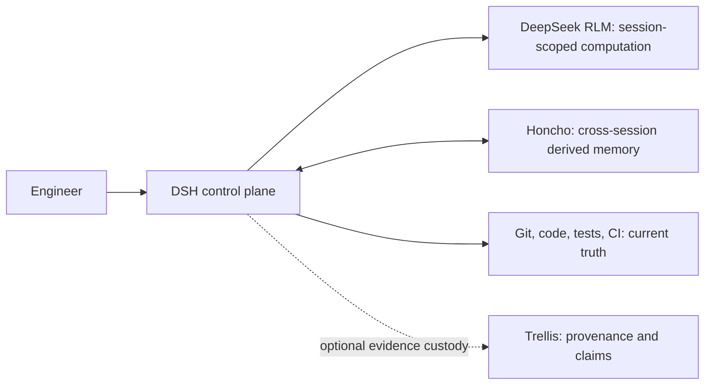

# DeepSeek Honcho

DeepSeek Honcho is the experimental cross-session memory layer for [DeepSeek Harness (DSH)](https://github.com/deepseek-ai/deepseek-harness). It integrates [Honcho](https://github.com/plastic-labs/honcho) without turning Honcho into a second harness and without treating generated memory as repository truth.

Status: architecture and implementation specification. No production plugin has been implemented yet.

## The decision

We will use two integration stages:

1. **MCP experiment:** connect DSH's existing MCP client to hosted or self-hosted Honcho and add a DSH-adapted memory skill. This is the fastest way to validate recall quality, identity mapping, isolation, correction, latency, and cost.
2. **Native Cordis plugin:** build an SDK-backed DSH capability that records completed root-agent exchanges automatically, injects bounded recall at the first step of a turn, and exposes a small safe tool surface. This is the target production architecture if the experiment passes its gates.

An MCP server plus a skill is sufficient to test Honcho. It is not sufficient for dependable always-on memory: a skill cannot guarantee that every completed exchange is recorded, and exposing Honcho's complete MCP schema adds token cost and destructive administration tools the model does not normally need.

## Where it fits

- DSH owns the agent loop, policy, model credentials, tools, session log, compaction, and lifecycle.
- DeepSeek RLM supplies persistent computation inside one agent session. It must re-read current code and artifacts.
- Honcho learns preferences, recurring intent, prior decisions, and useful cross-session history.
- Git, files, tests, and CI remain authoritative for the present state of the software.
- Trellis remains useful when a claim needs evidence-grade lineage, trust, or promotion; Honcho does not replace that job.

## Documents

- [`GAMEPLAN.md`](./GAMEPLAN.md) — phased rollout, decision gates, risks, and evaluation plan.
- [`SPEC.md`](./SPEC.md) — normative implementation contract for the MCP experiment and native plugin.
- [`IMPLEMENTATION_PROMPT.md`](./IMPLEMENTATION_PROMPT.md) — standalone prompt for a separate Codex implementation task.
- [`AGENTS.md`](./AGENTS.md) — repository rules for coding agents.

## Research baselines

The initial plan is grounded in these exact revisions:

| Upstream | Revision | Observed version |
| --- | --- | --- |
| DeepSeek Harness | [`99f6f02fecdb7dff40c3fbc9470f5907c29f74ca`](https://github.com/deepseek-ai/deepseek-harness/tree/99f6f02fecdb7dff40c3fbc9470f5907c29f74ca) | `dsh-v0.1.0-rc.7` |
| Honcho | [`ddbb90e36f2d148c7982f6ed85b09d31cabf5944`](https://github.com/plastic-labs/honcho/tree/ddbb90e36f2d148c7982f6ed85b09d31cabf5944) | MCP `3.0.0`; TypeScript SDK `2.3.0` |

Upgrades must be intentional and accompanied by contract and integration-test review.

## Important boundaries

- Honcho recall is untrusted, potentially stale context—not instructions and not proof.
- Root human/assistant exchanges are eligible for automatic capture. RLM/subagent chatter, tool outputs, system prompts, and injected memory are excluded by default.
- Honcho credentials stay in the DSH host process. They must not be copied into an RLM IPython kernel or model-visible configuration.
- Remote capture and recall are explicit opt-ins.
- Honcho's server repository is AGPL-3.0; its TypeScript SDK is Apache-2.0. Keep SDK use as a dependency and perform a licensing review before copying or modifying server/MCP source.
- This planning repository intentionally has no project license yet. Choose one before distributing implementation artifacts.
