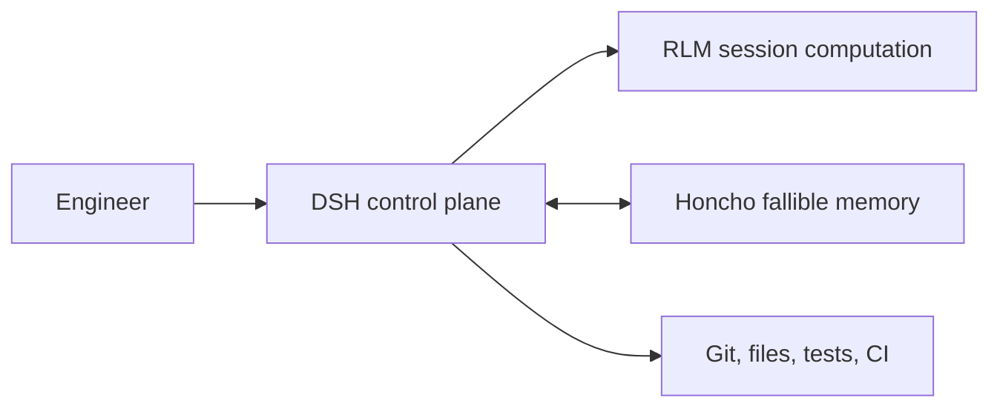

# DeepSeek Honcho

DeepSeek Honcho is a working, experimental cross-session memory integration for [DeepSeek Harness (DSH)](https://github.com/deepseek-ai/deepseek-harness). DSH remains the only agent runtime and control plane. Honcho is a fallible memory service; Git, current files, tests, CI, explicit corrections, DSH policy, and committed session events remain authoritative.

The repository implements two composable paths:

- Stage A uses DSH's existing MCP client and the DSH-adapted `honcho-memory` skill for evaluation.
- The native path provides a Cordis Service Definition, the official TypeScript SDK provider, lifecycle capture/recall Consumer, five-tool Consumer, and an optional bundle.

The deterministic and hosted synthetic evaluations now satisfy the section 22 promotion criteria, including fenced cleanup, while capture and recall remain explicit opt-ins. This is not a claim that Honcho met the raw 1500 ms latency target: the live run passed the specification's clean timeout/fail-open alternative and recorded material asynchronous lag. No package has been published, and the opt-in macOS release-intent job remains required before a first release.

## Packages

| Package | Responsibility |
| --- | --- |
| `@deepseek-honcho/dsh-honcho` | Provider-neutral `ctx.honcho` service, types, identity, sanitizer, and fake provider |
| `@deepseek-honcho/dsh-honcho-sdk` | Host-only `@honcho-ai/sdk@2.3.0` provider, atomic-file outbox, worker, retry/circuit/deduplication |
| `@deepseek-honcho/dsh-agent-memory` | Completed-root-turn capture and first-root-step untrusted recall |
| `@deepseek-honcho/dsh-tool-memory` | Exactly five host-scoped model tools |
| `@deepseek-honcho/dsh-honcho-bundle` | Optional composition of the preceding provider and Consumers |

The Service Definition, provider, lifecycle Consumer, tool Consumer, and bundle can be mounted separately. The bundle does not mount an agent loop, LLM adapter, policy service, ToolRuntime, or credential manager.

## Verified behavior

- Automatic capture and automatic recall are both off by default.
- When capture is enabled, only a completed root-agent exchange with direct user text and final assistant text is admitted. System/developer prompts, plugin-injected context, tool arguments/results, hidden reasoning, partial streams, attachments, errored turns, and child/subagent chatter are excluded.
- Text is normalized, regex-redacted, character/byte bounded, and deterministically identified before a versioned local outbox write. A user-visible turn never waits for remote Honcho delivery.
- Delivery uses one atomic JSON document per delivery, deterministic IDs/fingerprints, per-session ordering, cross-session concurrency, exponential backoff with jitter, an auth/transient circuit breaker, metadata-filter duplicate defense, partial-delivery handling, dead letters, bounded shutdown drain, and an HMR/process generation fence.
- Recall runs only on step 1 of a root turn by default, is time/item/token/query bounded, and is persisted with `{ kind: "plugin", plugin: "deepseek-honcho", form: "recall" }` provenance. Recalled text is wrapped as untrusted data and is never recaptured.
- The default model surface is only `memory_recall`, `memory_search`, `memory_record`, `memory_correct`, and `memory_status`. Identity is host-controlled; no tool accepts workspace, project, or human peer selection. No destructive Honcho administration tool is exposed.
- Timeout, outage, post-start auth failure, or processing lag fails open for recall and leaves writes in the local outbox.

## Quick start

Use Node `^22.19 || >=24` and pnpm `11.7.0`:

```sh
corepack pnpm@11.7.0 install --frozen-lockfile
corepack pnpm@11.7.0 verify
corepack pnpm@11.7.0 evaluate
```

Start with synthetic identities. Keep the real key only in the DSH host environment. See [`examples/native`](./examples/native/README.md) for native composition and [`examples/mcp`](./examples/mcp/README.md) for the Stage A experiment.

## Evaluation and live tests

`pnpm evaluate` executes the 12 deterministic cases in `tests/fixtures/evaluation-corpus.json` and writes only IDs, booleans, bounds, and aggregate metrics to `evaluation-results/latest.json`. It never writes conversation content. The corpus covers preferences, workspace/project/peer isolation, corrections, freshness against current evidence, sparse evidence, stored prompt injection, subagent exclusion, outage/fail-open, and long-history bounds.

`pnpm test:e2e` is skipped without `HONCHO_LIVE_TEST=1`. A live run also requires `HONCHO_API_KEY` and `HONCHO_LIVE_WORKSPACE_ID`; it creates unique synthetic peers/projects/sessions and never uses personal memory. It performs no destructive cleanup. Follow the operator procedure in [`docs/operations.md`](./docs/operations.md).

`pnpm evaluate:live` is the full opt-in comparison. With `HONCHO_LIVE_TEST=1` and `HONCHO_LIVE_PROVISION=1`, it writes a cleanup manifest before provisioning two run-prefixed synthetic workspaces, executes the corpus through the native SDK provider, waits boundedly for Honcho processing, and persists only content-free case/latency/token/request/cost-availability evidence. It never cleans up implicitly. After inspection, `HONCHO_LIVE_CLEANUP=1 pnpm cleanup:live` verifies ownership and remote metadata fences, deletes the synthetic sessions/workspaces, verifies absence, and updates the report.

The 2026-08-21 hosted run is summarized in [`docs/live-evaluation-2026-08-21.md`](./docs/live-evaluation-2026-08-21.md). The content-free aggregate records `promotionClaimed: true`; deterministic-only `pnpm evaluate` intentionally continues to claim no live promotion by itself.

## Trust and runtime boundaries



Credentials are read from a host-selected environment-variable name by the SDK provider. They are not included in tool schemas/results, model context, DSH events, logs, fixtures, or the RLM bridge. RLM may call memory only through its `dsh_tools.call(...)` host bridge, which routes into `ctx.tools.execute` and therefore DSH policy and telemetry. The IPython kernel itself is not a sandbox; direct Python, filesystem, network, and subprocess activity has kernel-process OS authority. Use an external OS/container sandbox for untrusted code.

Hosted mode sends eligible bounded text to the configured Honcho service. Self-hosted mode changes the destination, not the egress fact. The local outbox and dead letters contain redacted but still sensitive conversation text. See [`SECURITY.md`](./SECURITY.md) and [`docs/operations.md`](./docs/operations.md).

## Provenance and licenses

- DeepSeek Harness revision `99f6f02fecdb7dff40c3fbc9470f5907c29f74ca` (`dsh-v0.1.0-rc.7`), MIT; exact `0.1.0-rc.7` packages.
- Honcho revision `ddbb90e36f2d148c7982f6ed85b09d31cabf5944`; server/MCP AGPL-3.0, inspected as an external service contract only.
- `@honcho-ai/sdk` exactly `2.3.0`, Apache-2.0, used as a dependency.
- DeepSeek RLM revision `79b6b28e16c7305e8e791f2d8c9d2935e75ade60`, MIT, inspected for the host-bridge and empty-by-default kernel environment contracts; not a dependency.
- This repository and its five packages are Apache-2.0.

No Honcho server/MCP source was copied. No DSH patch was required: the pinned public `session/event`, `agent/pre-step`, Service, MCP, and ToolRuntime seams were sufficient. Machine-readable details are in [`provenance/upstreams.json`](./provenance/upstreams.json) and [`THIRD_PARTY_NOTICES.md`](./THIRD_PARTY_NOTICES.md).

## Project documents

- [`SPEC.md`](./SPEC.md) is normative.
- [`GAMEPLAN.md`](./GAMEPLAN.md) records the rollout rationale.
- [`docs/operations.md`](./docs/operations.md) covers deployment, outbox, retention, and live tests.
- [`docs/verification.md`](./docs/verification.md) maps milestone and Definition-of-Done evidence and remaining external gates.
- [`SECURITY.md`](./SECURITY.md) defines the security/privacy boundary.
